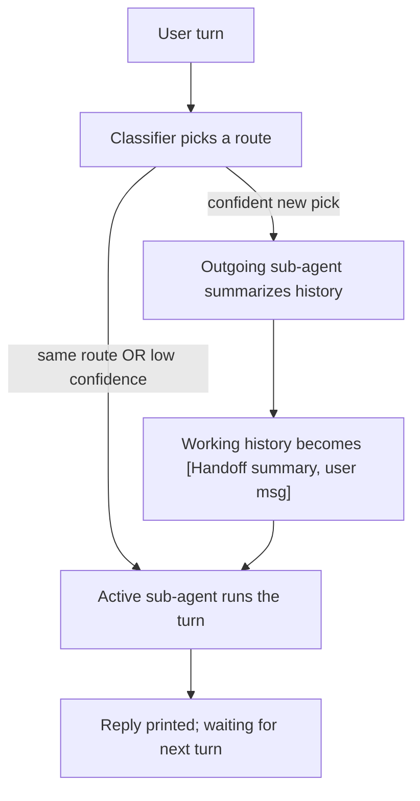

# Router Agents

A **router agent** is a meta-agent that combines several specialized
sub-agents under one name. Each user turn is first sent to a cheap-ish
classifier that picks which sub-agent should reply. The chat session
moves between sub-agents automatically based on what the user is
actually trying to do, instead of forcing the user to switch agents by
hand.

The canonical example is a `planner` / `builder` pair:

- While the user is exploring or scoping ("how should we structure
  this?"), the planner replies.
- Once the user says "looks good, let's build it", the router hands the
  conversation off to the builder with a summary of what was decided.

## Configuration

Router agents live in the same `agents:` map as regular agents. The
distinguishing field is `kind: router`.

```yaml
agents:
  planner:
    model: gemini-3.1-pro-preview
    system_prompt: |
      You are the PLAN agent. Help the user scope and design changes
      without touching the codebase.
    tools:
      - name: view_file
      - name: list_dir
      - name: todo

  builder:
    model: gemini-3.1-pro-preview
    system_prompt: |
      You are the BUILD agent. Implement the plan the user has approved.
    tools:
      - name: view_file
      - name: list_dir
      - name: str_replace_editor
      - name: write_to_file
      - name: bash

  dev:
    kind: router
    classifier:
      model: gemini-3.1-pro-preview
      default_route: planner
      confidence_threshold: 0.7
    routes:
      - agent: planner
        when: "User is exploring, scoping, or asking 'how should we...'."
      - agent: builder
        when: "User has approved a plan and wants code changes implemented (e.g. 'looks good, let's build it')."
```

You then engage the router as you would any other agent:

```bash
agents engage dev
```

Router agents are currently authored in YAML only. `agents add` does not
yet provide a `--kind=router` shortcut because the router schema is
richer than what a flat flag set can comfortably express.

## Configuration reference

### Top-level fields

| Field        | Required | Description                                            |
|--------------|----------|--------------------------------------------------------|
| `kind`       | yes      | Must be `router`.                                      |
| `classifier` | yes      | Classifier configuration. See below.                   |
| `routes`     | yes      | At least 2 routes pointing to plain (non-router) agents. |

The fields used by plain agents (`model`, `system_prompt`, `tools`, etc.)
are ignored on a router and may be omitted.

### `classifier`

| Field                  | Required | Default   | Description                                                                                          |
|------------------------|----------|-----------|------------------------------------------------------------------------------------------------------|
| `model`                | yes      | —         | Model used for the per-turn route pick. A strong model is fine here; the call is small and rare.     |
| `default_route`        | yes      | —         | Which route to start on, and to fall back to on low confidence.                                       |
| `strategy`             | no       | `sticky`  | Only `sticky` is supported in v1.                                                                    |
| `confidence_threshold` | no       | `0.7`     | A switch is only performed when the classifier's confidence in a *different* route exceeds this.     |

### `routes`

Each route binds a name from the `agents:` map to a short natural-language
hint shown to the classifier. The `when` text is the most important
knob you have for routing quality — keep it focused on user intent, not
on what the sub-agent does internally.

```yaml
routes:
  - agent: planner
    when: "User is exploring, scoping, or asking 'how should we...'."
  - agent: builder
    when: "User has approved a plan and wants code changes implemented."
```

## Runtime behavior



Key points:

- **Sticky.** The classifier runs every turn but switching only happens
  when it confidently picks a different route. This keeps the experience
  predictable and minimizes handoff overhead.
- **Summary-based handoff.** When a switch happens, the outgoing
  sub-agent summarizes the conversation so far (reusing the same
  summarizer the in-AI compactor uses). The new sub-agent's view of the
  conversation starts at a clean user-text boundary:
  `[Handoff from <prev>]\n<summary>` followed by the user's latest
  message. This trivially avoids orphan `tool_use` / `tool_result`
  blocks across the handoff.
- **Shared audit session.** A router opens a single audit session for
  the whole chat. All classifier picks, sub-agent messages, tool calls,
  and handoffs are recorded under one `session_id` so the audit-viewer
  can render them in order.

## Audit events

Routers add two event types on top of the standard agent events:

| Event             | Payload fields                                        |
|-------------------|-------------------------------------------------------|
| `route_selection` | `route`, `confidence`, `reason`, `latency_ms`         |
| `handoff`         | `from`, `to`, `summary`                               |

`route_selection` is emitted on every user turn (including stays).
`handoff` is emitted only when a switch actually happens.

## Limitations (v1)

- **No nested routers.** A route must point at a plain agent.
- **No mid-turn handoff.** The model cannot ask the router to switch
  while it is mid-reply; switches happen at user-turn boundaries only.
- **No `per_turn` strategy.** Only `sticky` is supported.
- **Single CLI invocation.** Sub-agent state (e.g. the `todo` tool) is
  shared across the router invocation but is not persisted across
  CLI runs.
- **`agents add` does not author routers.** Edit YAML directly.
