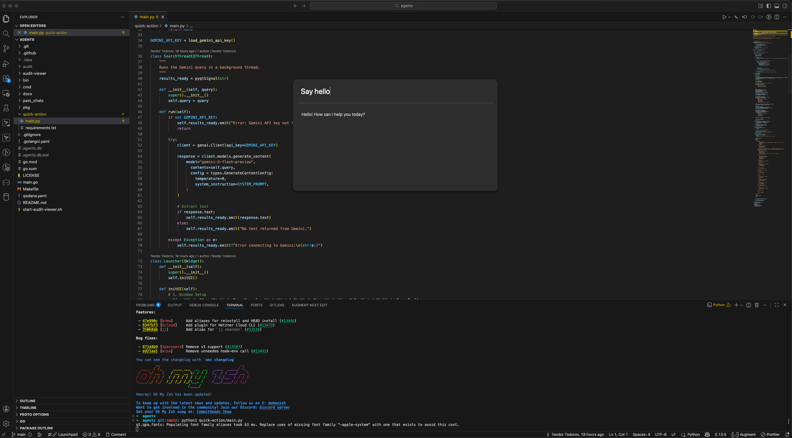

# Quick AI Assistant Launcher

This Python script creates a **quick AI assistant launcher** with a floating GUI window.

## Main Functionality

- Provides a search box where users can type questions
- Sends queries to Google's Gemini AI (gemini-3-flash-preview model) for quick answers

## Configuration

This script requires only the Gemini API key to be configured in `~/.agents/config.yaml`. Similar to the agent CLI.

## Use Case

A Spotlight/Alfred-style quick launcher for asking AI questions without opening a browser or full application.
